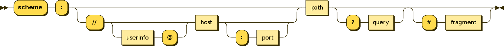

# URL构成

## 简介

[URL（Uniform Resource Locator）](https://en.wikipedia.org/wiki/URL)用于表示互联网上资源（文件）的具体位置

## 语法

`URL`的实现符合通用的`URI（Uniform Resource Identifier）`语法，由五个组件的层次结构序列组成

```
URI = scheme:[//authority]path[?query][#fragment]
```

其中`authority`部分还可分为`3`个组件

```
authority = [userinfo@]host[:port]
```

所以完整的语法如下：

```
scheme:[//[userinfo@]host[:port]]path[?query][#fragment]
```



## 语法解析

* `scheme`组件表示传输协议，常用的有`http/https/ftp/mailto/file`等等
* `authority`组件用于指定服务器位置，指定主机名和端口号，还可能包含用户名和密码
    * 如果包含用户名和密码：`[//[username[:passwd]]host[:port]]`
    * 通常仅指定主机名和端口号：`[//host[:port]]`
    * 主机名可以用`IP`地址或者域名表示；如果忽略端口号，表示使用`80`端口
* `path`组件指定资源在服务器中的位置
* `query`组件表示查询参数，包含一组查询字符串
    * 其语法没有很好定义，通常是由一个分隔符分隔的一系列属性-值对
    * `key1=value1&key2=value2`
* `fragment`组件表示锚部分，指定文件打开时页面滚动到锚点位置

## 示例

### 一

```
https://www.zhujian.tech
```

* 指定传输协议为`https`
* 主机名为`www.zhujian.tech`
* 使用默认端口`80`

### 二

```
https://github.com/zjZSTU/network-guide
```

* 指定传输协议为`https`
* 主机名为`github.com`
* 使用默认端口`80`
* 资源路径为`/zjZSTU/network-guide`

### 三

```
http://localhost:8080/jenkins
```

* 指定传输协议为`http`
* 主机名为`localhost`
* 指定端口`8080`
* 资源路径为`/jenkins`

### 四

```
https://fanyi.baidu.com/?aldtype=16047#zh/en/
```

* 指定传输协议为`https`
* 主机名为`fanyi.baidu.com`
* 使用默认端口`80`
* 资源路径为`/`
* 查询参数为`aldtype=16047`
* 锚点位置为`zh/en/`

## 相关阅读

* [快速搞懂URL的构成](https://www.jianshu.com/p/406d19dfabd3)
* [URL的各个组成部分详解](https://blog.csdn.net/irony0egoist/article/details/81019440)