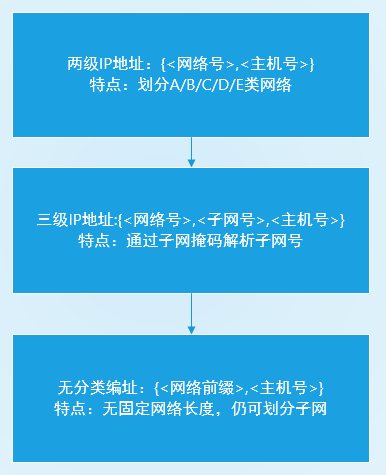

# IP地址

[IP地址（internet protocol address）](https://baike.baidu.com/item/IP%E5%9C%B0%E5%9D%80)全称是互联网协议地址，也称为网际协议地址。`IP`地址使用`IP`协议为主机和网络提供统一格式的逻辑地址，其目的是屏蔽物理地址的差异

目前最常用的`IP`地址包括`IPv4`地址和`IPv6`地址

## IPv4地址

[IPv4(internet protocol version 4)](https://baike.baidu.com/item/IPv4)表示`IP`协议的第`4`个版本，`IP`协议地址是目前最常用的地址格式

### 格式

`IPv4`地址长`32`位（`4`个字节），以`点分十进制`形式表示，即`4`个字节用点号隔开，以十进制表示

> a.b.c.d

### 结构

`IPv4`地址结构经历过三个大的改变，一是设置两级`IP`地址，二是添加子网字段设置三级`IP`地址，三是无分类编址



#### 设置两级`IP`地址

`ipv4`地址由两部分组成：

> ipv4地址 = {<网络号>,<主机号>}

网络号标志主机（或路由器）所连接到的网络

主机号标志该主机（或路由器）

根据网络号的不同长度可分为`A/B/C/D/E`类网络

* `A`类地址网络号长度为`1`个字节，前`1`位是类别位，规定为`0`
* `B`类地址网络号长度为`2`个字节，前`2`位是类别位，规定为`10`
* `C`类地址网络号长度为`3`个字节，前`3`位是类别位，规定为`110`
* `D`类地址没有网络号，前`4`位是类别位，规定为`1110`
* `E`类地址没有网络号，前`4`位为类别位，规定为`1111`

`A/B/C`类地址是单播地址，用于一对一通信

`D`类地址是多播地址，用于一对多通信

`E`类地址保留为以后使用

#### 添加子网字段设置三级IP地址

`IPv4`地址由三部分组成：

> IPv4地址 = {<网络号>,<子网号>,<主机号>}

网络号标志主机（或路由器）所连接到的网络

子网号标志主机（或路由器）所连接到的子网

主机号标志该主机（或路由器）

通过子网掩码区分子网号和主机号，子网掩码长`32`位，与`ipv4`地址一一对应，网络号和子网号的对应位置为`1`，主机号的对应位置为`0`

比如设置`B`类地址的子网号占3位，那么主机号占`13`位，子网掩码为

```
# 二进制
11111111 11111111 11100000 00000000
# 点分十进制
255.255.224.0
```

通过`IPv4`地址和子网掩码进行`与运算`，得到子网号和主机号

##### 默认子网掩码

若网络不划分子网，就使用默认子网掩码

* `A`类地址的默认子网掩码是`255.0.0.0`
* `B`类地址的默认子网掩码是`255.255.0.0`
* `C`类地址的默认子网掩码是`255.255.255.0`

##### 子网个数

根据`RFC 950`文档，子网号不能为全`1`或全`0`（全`0`表示本网络，全`1`表示广播地址）

比如上例中B类地址的子网号占`3`位，子网掩码为`255.255.224.0`，其可划分子网数为`2^3-2=6`

##### 主机号划分

主机号不能分配全`1`和全`0`地址

比如上例中`B`类地址的子网号占`3`位，那么主机号占`13`位，其可分配主机号个数为`2^13-2=8190`

#### 无分类编址

无分类域间路由选择(`Classles Inter-Domain Routing, CIDR`)取消之前的`A/B/C/D/E`类地址和子网划分概念，将`32`位`IP`地址划分为前后两个部分

> IPv4地址 = {<网络前缀>,<主机号>}

其中网络前缀长度任意，通过斜线记法(`slash notation`)，在`ip`地址后加上斜线，后面写上网络前缀的位数

> xxx.xxx.xxx.xxx/22

在路由选择中使用`32`位的地址掩码，网络前缀的对应位数为`1`，主机号的对应位数为`0`

##### 子网划分

各自单位在获取无分类编址后，仍旧可以划分子网，在原先的网络前缀中再加上子网位数

比如网络前缀长度为`20`，再继续划分`8`个子网（占`3`位），那么每个子网的网络前缀长度变成`23`位

##### 子网个数

根据`RFC 1878`文档，子网数可以为全`1`或者全`0`

## IPv6地址

[IPv6（internet protocol version 6）](https://baike.baidu.com/item/IPv6)表示`IP`协议的第`6`个版本，其目的是提供更多的`IP`地址，解决`IPv4`地址资源有限的问题

`IPv6`地址长度为`128`位，采用`16`进制表示，使用`冒分十六进制`表示法

格式为`X:X:X:X:X:X:X:X`，每个`X`表示`16`位，用十六进制表示，比如`ABCD:EF01:2345:6789:ABCD:EF01:2345:6789`（每个`X`的前导`0`可以省略）

## 相关阅读

* [IP地址](https://www.zhihu.com/topic/19592543/intro)
* [子网划分](https://baike.baidu.com/item/%E5%AD%90%E7%BD%91%E5%88%92%E5%88%86)