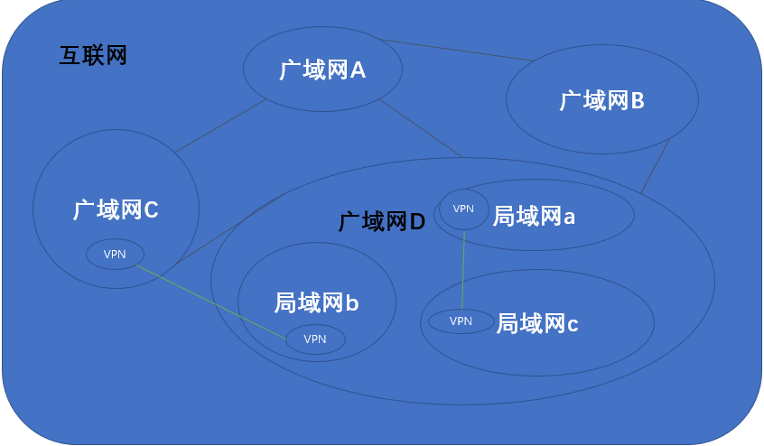

# 局域网、广域网、互联网和私有专用网

## 局域网

[局域网（Local Area NetWork, LAN）](https://baike.baidu.com/item/%E5%B1%80%E5%9F%9F%E7%BD%91)指在某一区域内由多台计算机互联组成的计算机网络。局域网内的主机通过同一个路由器对外传输和转发数据，通过若干个集线器或交换机进行内部交流。局域网通常覆盖的地理范围小，建设、维护和扩展灵活，同时网络延时低，数据传输率高，可靠性高

## 广域网

[广域网（Wide Area Network, WAN）](https://baike.baidu.com/item/%E5%B9%BF%E5%9F%9F%E7%BD%91)指的是连接多个局域网或城域网通信的计算机网络

## 互联网

[互联网（Internet）](https://baike.baidu.com/item/%E4%BA%92%E8%81%94%E7%BD%91/199186)指的是通过一组通用协议来串联不同广域网从而得到的计算机网络

## 虚拟专用网

[虚拟专用网（Visual Private Network, VPN）](https://baike.baidu.com/item/%E8%99%9A%E6%8B%9F%E4%B8%93%E7%94%A8%E7%BD%91)在公网上建立专用网络，进行加密通讯。它模拟了单个局域网内的通信，但实际是通过公网进行不同局域网之间的远程通信

## 相互关系

## 相关阅读

* [局域网](https://www.zhihu.com/topic/19562846/intro)
* [局域网,广域网,因特网之间的区别和联系?](https://www.zhihu.com/question/51295773)
* [VPN](https://www.zhihu.com/topic/19551882/hot)