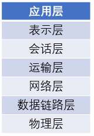
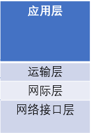
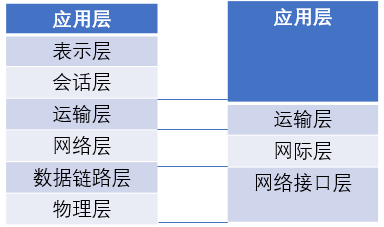

# 网络体系结构

计算机网络的各层及其协议的集合就是计算机网络体系结构。其设计目的是通过对网络的分层，将各个系统硬软件的差异转化成较小的局部问题，更易于研究和处理，最终保证遵循同一套体系结构的系统能够相互通信

目前并行有两套网络体系结构：

1. 开放系统互联基本参考模型`OSI/RM`
2. `TCP/IP`体系结构

## 开放系统互联基本参考模型OSI/RM

开发系统互联基本参考模型（`Open Systems Interconnection Reference Model, OSI/RM`）是国际标准化组织`ISO`制定的，在`1983`年形成正式的文件，即`ISO 7498`国际标准，简称为`OSI`

`OSI`是一个`7`层协议的体系结构，从上到下分别是应用层、会话层、表示层、运输层、网络层、数据链路层、物理层

*`OSI`并没有获得大规模的应用，因为同一时期出现的`TCP/IP`四层网络系统结构已经抢先在全世界大范围的运行*

## TCP/IP体系结构

`TCP/IP`体系结构共`4`层，分别由应用层、运输层、网际层和网络接口层构成

其与`OSI`体系结构对应如下

## 层解析

1. 应用层（`application layer`）：其任务是通过应用进程间的交互来完成特定网络应用
2. 运输层（`transport layer`）：其任务是负责向两台主机之间的通信提供通用的数据传输服务。应用进程通过该服务来传送`应用层报文`
3. 网络层（`network layer`）：负责为分组交换网上的不同主机提供通信服务。在发送数据时，将运输层生成的`报文段`或`用户数据报`封装成`分组`或`包`进行传送
4. 数据链路层（`data link layer`）：负责两台主机之间的数据在链路上的传输。将网络层得到的`数据包`封装成`帧`
5. 物理层（`physical layer`）：确定电压大小（多大是`1`、多大是`0`）以及接收方如何识别发送方所发送的比特等关于硬件的参数

## 相关阅读

* [OSI七层模型和两主机传输过程(转)](https://www.jianshu.com/p/d8dbe0798d4c)