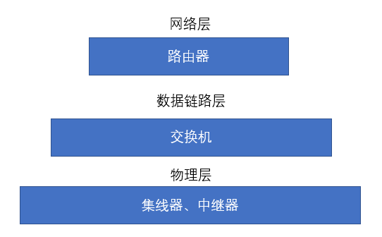

# 路由器、交换机、集线器、中继器

网络和主机之间的传输依赖于硬件支持，常用的信号传输设备有集线器、中继器、路由器和交换机

## 路由器

[路由器（Router）](https://baike.baidu.com/item/%E8%B7%AF%E7%94%B1%E5%99%A8)又称为网关设备（`Gateway`），用于连接多个逻辑上分开的网络，是连接互联网中各局域网和广域网的设备

路由操作在网络层进行，路由器属于网络层的互联设备

## 交换机

[交换机（Switch）](https://baike.baidu.com/item/%E4%BA%A4%E6%8D%A2%E6%9C%BA)作用于数据链路层，通过`MAC`地址为接入交换机的任意两个节点提供独享的电信号通路，通常分为广域网交换机和局域网交换机

## 集线器

[集线器（Hub）](https://baike.baidu.com/item/%E9%9B%86%E7%BA%BF%E5%99%A8)主要功能是对接收到的信号进行再生放大，以扩大网络传输距离。集线器工作在局域网环境，属于物理层的互联设备

## 中继器

[中继器（RP repeater）](https://baike.baidu.com/item/%E4%B8%AD%E7%BB%A7%E5%99%A8)作用于物理层，其作用于两个同类网络的互联，主要功能是通过对数据信号的放大和转发，来扩大网络传输的距离

## FAQ

**1. 路由器和交换机的区别？**

交换机根据`MAC`地址进行数据的传输和转发；而路由器根据`IP`地址进行数据的传输和转发

它们作用在网络体系结构中的不同层，交换机作用于数据链路层，路由器作用于网络层

**2. 交换机和集线器的区别？**

集线器仅对物理电信号进行放大，发送数据没有目标，对所有节点进行广播

交换机根据数据头的`MAC`地址进行转发，不会影响其他节点

集线器作用于物理层，交换机作用于数据链路层

**3. 集线器和中继器的区别？**

中继器仅有两个端口，仅起到连接作用

集线器有多个端口，除了再生放大信号其扩大网络距离外，还同时把所有节点集中在以它为中心的节点上，所有端口处于同一个冲突域，这样单条网络线路的故障不影响其他线路

## 相关阅读

* [中继器](https://www.zhihu.com/topic/20138474/intro)
* [如何跟小白解释路由器和交换机的区别？并且家用路由器充当了猫和路由器和交换机的功能吗？](https://www.zhihu.com/question/22007235/answer/402261894)
* [集线器和交换机的区别？](https://www.zhihu.com/question/21782368/answer/31826769)
