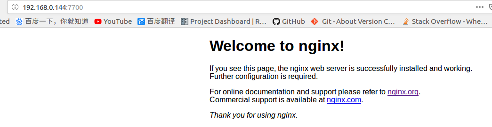
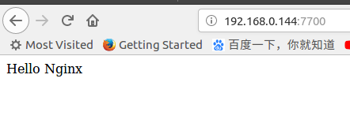

# [Docker]nginx安装

## 镜像下载

`Docker`提供了官方[nginx](https://hub.docker.com/_/nginx)镜像

```
$ docker pull nginx
```

## 启动

使用如下命令：

```
$ docker run --name nginx-test -p 7700:80 -d nginx
```

* `--name`：容器名
* `-p`：映射主机`7700`端口到容器`80`端口
* `-d`：后台运行

打开浏览器，登录`localhost:7700`查看是否成功



## 配置

在主机创建文件夹

```
$ mkdir -p ~/nginx/www ~/nginx/logs ~/nginx/conf.d
```

* `www`：保存`html`文件
* `logs`：保存`nginx`运行日志
* `conf.d`：保存配置文件

将容器内`Nginx`配置文件拷贝到主机

```
$ docker cp CONTAINER_ID:/etc/nginx/nginx.conf ~/nginx
$ docker cp COMTAINER_ID:/etc/nginx/conf.d/default.conf ~/nginx/conf.d

:~/nginx$ tree
.
├── conf.d
│   └── default.conf
├── logs
│   ├── access.log
│   └── error.log
├── nginx.conf
└── www
    └── index.html
```

修改配置文件`~/nginx/conf.d/default.conf`，修改`Location`

```
...
...
    location / {
        #root   /usr/share/nginx/html;
        root   /opt/www;
        index  index.html index.htm;
    }
...
...
```

在`~/nginx/www`目录下创建文件`index.html`

```
<!DOCTYPE html>
<html>
<head>
<title>Docker Nginx</title>
</head>

<body>
Hello Nginx
</body>

</html>
```

重新启动`nginx`（*注意端口冲突，可以调整主机端口或停止之前的容器*），命令如下：

```
$ docker run -d -p 7700:80 \
    --name nginx-test-web \
    -v ~/nginx/www:/opt/www \
    -v ~/nginx/logs:/var/log/nginx \
    -v ~/nginx/conf.d:/etc/nginx/conf.d \
    -v ~/nginx/nginx.conf:/etc/nginx/nginx.conf \
    nginx
```

* `-d`：后台运行
* `-p`：映射主机`7700`端口到容器`80`端口
* `--name`：设置容器名
* `-v`：挂载本地目录到容器中



上述操作后`nginx`将使用主机保存的配置文件，可以修改`~/nginx/conf.d/default.conf`，重新启动正在运行的容器即可更新配置

```
$ docker restart COMTAINER_ID
```

## 相关阅读

* [Docker 安装 Nginx](https://www.runoob.com/docker/docker-install-nginx.html)