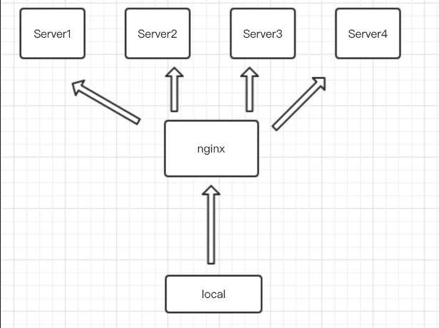
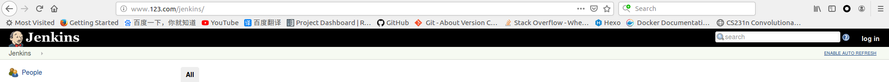

# 反向代理

## 反向代理简介

[反向代理（reverse proxy）](https://www.jianshu.com/p/b1debd31149b)用于代理服务器，用户输入代理服务器地址，通过`nginx`请求正确的服务器地址，并将资源返回给用户



## 配置

使用指令`proxy_pass`指定反向代理的服务器地址，在`/etc/nginx/conf.d/`目录下添加配置文件`test.conf`

```
{
    listen 80;
    server_name localhost;

    location /jk/ {
        proxy_pass http://localhost:8080/jenkins/;
    }
}
```

当`URL`符合`localhost/jenkins/`时，`nginx`将会请求代理地址

**注意**：上面的代理服务器地址指定了资源地址为`/jenkins/`，则该字段将替代`location`匹配的参数`/jk`。比如客户端请求地址为`http://localhost/jk/page.html`，`nginx`代理后的地址为`http://localhost:8080/jenkins/page.html`

所以上面代码也可以修改如下：

```
...
    location /jenkins/ {
        proxy_pass http://localhost:8080;
    }
...
```

## 反向代理过程

`nginx`安装在本地，所以当`URL`输入`localhost/jenkins/`时

1. 解析域名为`IP`地址`127.0.0.1`，请求本地`nginx`进行处理
2. `nginx`将`URL`转换成`http://localhost:8080/jenkins/`后再次请求
3. `nginx`获得`html`数据后转发给浏览器

下面实现输入`www.123.com/jenkins/`，反向代理到`http://localhost/jenkins/`

修改`/etc/hosts`文件，将域名`www.123.com`映射到`nginx`服务器地址`127.0.0.1`

```
127.0.0.1   www.123.com
```

添加`nginx`配置文件`/etc/nginx/conf.d/test.conf`

```
server {
    listen       80;
    server_name  www.123.com;

    location /jenkins/ {
        proxy_pass  http://localhost:8080/jenkins/;
    }
}
```

热更新`nginx`

```
$ sudo nginx -s reload
```

在浏览器登录`www.123.com/jenkins/`，即可登录本地安装的`jenkins`



**如果不成功，可能是由于`DNS`缓存的关系，需要清空浏览器缓存和系统缓存**

## 相关阅读

* [Module ngx_http_proxy_module](https://nginx.org/en/docs/http/ngx_http_proxy_module.html#proxy_set_header)

* [NGINX Reverse Proxy](https://docs.nginx.com/nginx/admin-guide/web-server/reverse-proxy/#pass)

* [nginx location 语法](https://blog.csdn.net/zhang_referee/article/details/88958074)

* [nginx做反向代理处理http请求的过程](https://blog.csdn.net/yusiguyuan/article/details/39249497)