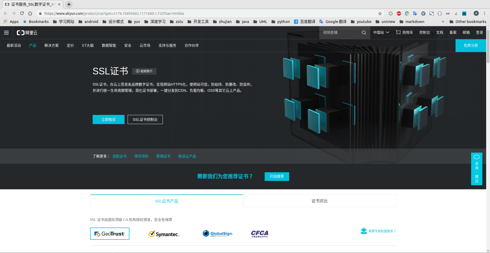
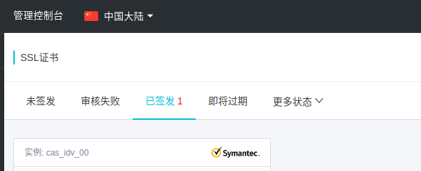

# [阿里云]配置HTTPs

共分`4`步进行：

1. 申请`CA`服务
2. 配置`CA`证书
3. 配置`nginx`
4. 重启`nginx`

**`Note`：当前`Nginx`版本为`nginx version: nginx/1.14.2`**

>由于版本问题，配置文件可能存在不同的写法。例如：Nginx 版本为 nginx/1.15.0 以上请使用 listen 443 ssl 代替 listen 443 和 ssl on。

## 申请`CA`服务

首先在[阿里云](https://www.aliyun.com/?utm_content=se_1000301881)或[腾讯云](https://cloud.tencent.com/?fromSource=gwzcw.2212127.2212127.2212127&utm_medium=cpd&utm_id=gwzcw.2212127.2212127.2212127)上申请[CA证书服务](https://www.aliyun.com/product/cas?spm=5176.10695662.1171680.1.752f3ae1Hnibka)

*注：有免费`CA`证书可以申请*

## 配置`CA`证书

购买完成后进入控制台，下载相应的实例（选择`nginx`版本下载）

是一个`zip`压缩包，里面有两个文件：一个`.key`文件（加密）和一个`.pem`文件（证书）

在`nginx`配置路径下新建文件夹`cert`，解压放置其中

    /etc/nginx/cert/

## 配置`nginx`

修改`/etc/nginx/conf.d/default.conf`文件如下：

    $ cat default.conf 
    server {
        listen 80; # http端口
        server_name 自己的域名;
        return 301 https://$host$request_uri; # 跳转到https
    }
    server {
        listen       443; # https端口
        server_name  自己的域名;

        charset utf-8;
        #charset koi8-r;
        #access_log  /var/log/nginx/host.access.log  main;

        ssl on;
        ssl_certificate cert/1771479_www.zhujian.tech.pem;
        ssl_certificate_key cert/1771479_www.zhujian.tech.key;
        ssl_session_timeout 5m;
        ssl_protocols TLSv1 TLSv1.1 TLSv1.2;
        ssl_ciphers ECDHE-RSA-AES128-GCM-SHA256:ECDHE:ECDH:AES:HIGH:!NULL:!aNULL:!MD5:!ADH:!RC4; # 阿里云和腾讯云会有差别
        ssl_prefer_server_ciphers on;

        location / {
            root   /home/ubuntu/blogs; # 静态文件根路径
            index  index.html index.htm;
        }

        error_page  404              /404.html;

        # redirect server error pages to the static page /50x.html
        #
        error_page   500 502 503 504  /50x.html;
        location = /50x.html {
            root   /usr/share/nginx/html;
        }

        # proxy the PHP scripts to Apache listening on 127.0.0.1:80
        #
        #location ~ \.php$ {
        #    proxy_pass   http://127.0.0.1;
        #}

        # pass the PHP scripts to FastCGI server listening on 127.0.0.1:9000
        #
        #location ~ \.php$ {
        #    root           html;
        #    fastcgi_pass   127.0.0.1:9000;
        #    fastcgi_index  index.php;
        #    fastcgi_param  SCRIPT_FILENAME  /scripts$fastcgi_script_name;
        #    include        fastcgi_params;
        #}

        # deny access to .htaccess files, if Apache's document root
        # concurs with nginx's one
        #
        #location ~ /\.ht {
        #    deny  all;
        #}
    }

## 重启`nginx`

先测试配置文件是否正确

    $ sudo nginx -t
    nginx: the configuration file /etc/nginx/nginx.conf syntax is ok
    nginx: configuration file /etc/nginx/nginx.conf test is successful

再重启`nginx`

    $ sudo service nginx restart

## 相关阅读

* [Nginx/Tengine服务器安装SSL证书](https://help.aliyun.com/knowledge_detail/95491.html?spm=5176.2020520154.cas.25.220e56a7X6XAdR)

* [2. Nginx 证书部署](https://cloud.tencent.com/document/product/400/4143#2.-nginx-.E8.AF.81.E4.B9.A6.E9.83.A8.E7.BD.B2)
