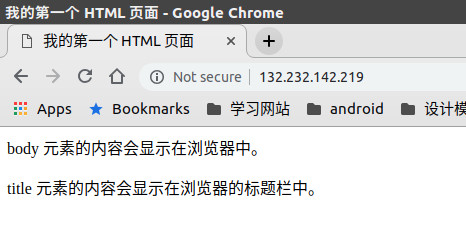

# 托管网站

`nginx`启动后，打开浏览器输入服务器`ip`，显示一个欢迎页面，其地址为

    /usr/share/nginx/html/index.html

其在配置文件`/etc/nginx/conf.d/default.conf`中引用

    $ cat conf.d/default.conf
    server {
            listen       80;
            server_name  localhost;
            ...
            location / {
                root   /usr/share/nginx/html;
                index  index.html index.htm;
            }
            ...
        }

## 托管静态文件

新建文件夹`blogs`

    $ mkdir blogs
    $ cd blogs/
    $ pwd
    /home/ubuntu/blogs

在里面新建文件`index.html`

    $ vim index.html
    <html>

    <head>
    <title>我的第一个 HTML 页面</title>
    </head>

    <body>
    
body 元素的内容会显示在浏览器中。

    
title 元素的内容会显示在浏览器的标题栏中。

    </body>

    </html>

修改`default.conf`文件，修改`root`路径为`blogs`

    $ sudo vim default.conf
    server {
        ...
        location / {
            root   /home/ubuntu/blogs;
            index  index.html index.htm;
        }
    }

重启`nginx`

    sudo source nginx restart

在浏览器输入服务器`ip`

## 绑定域名

参考：[Server names](https://nginx.org/en/docs/http/server_names.html)

修改`default.conf`下的`server_name`选项，设置成自定义域名

    server {
        listen       80;
        server_name  example.org  www.example.org;
        ...
    }

然后到域名解析中添加服务器`ip`

**注意：需要云服务器开启`80`端口，腾讯云服务器需要进行安全组配置**

## 绑定`404`页面

修改`default.conf`，取消`404`页面的注释，使用`root`路径下的`404.html`（也可以设置成其他路径）

    #error_page  404              /404.html;

## 相关阅读

* [Ubuntu服务器使用Nginx配个静态网站](https://www.jianshu.com/p/a7603c86811b)
* [W3School TIY](http://www.w3school.com.cn/tiy/t.asp?f=html_basic)