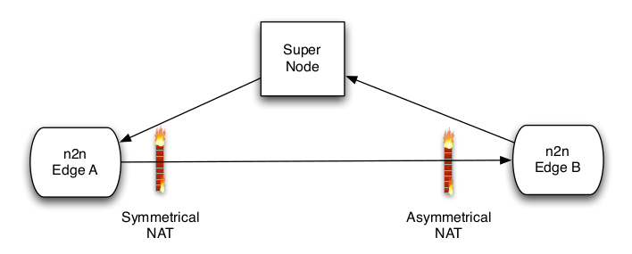

# n2n原理

[n2n](https://www.ntop.org/products/n2n/#)是一个开源的`2`层`P2P`架构`VPN`，有如下特点：

1. 基于`P2P`协议的加密`2`层专用网络
2. 边缘节点(`edge node`)的加密是使用带有用户自定义密码的开放协议
3. 每个`n2n`用户可以同时加入不同的网络（或称为社区）
4. `n2n`能够以反向流量方向（即从外部到内部）跨越`NAT`和防火墙。防火墙不再是`IP`级别直接通信的障碍。
5. `n2n`网络并不意味着是独立的：可以通过`n2n`和非`n2n`网络连接。

## 网络结构

`n2n`是一个`2`层网络架构，分别由核心节点(`supernode`)和边缘节点(`edgenode`)构成

边缘节点运行在客户端，通过创建虚拟网卡作为`n2n`网络的入口

核心节点作为服务器端，作为边缘节点的目录寄存器(`directory register`)和包路由器(`packet router`)

## `n2n`优势

`n2n`网络通过虚拟网卡，利用`UDP`协议进行通信，每个边缘节点（客户端）可以创建多个虚拟网卡，可以从属于多个不同网络

边缘节点通过核心节点握手后可以直接通信，这样能够降低通信的延时，也能够减轻核心节点的带宽压力

