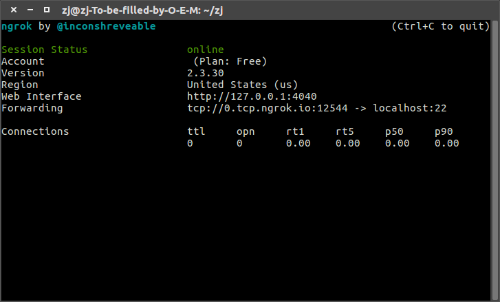
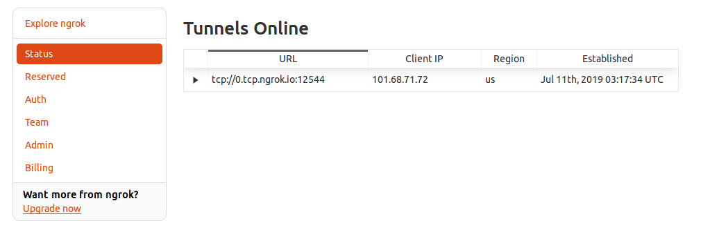
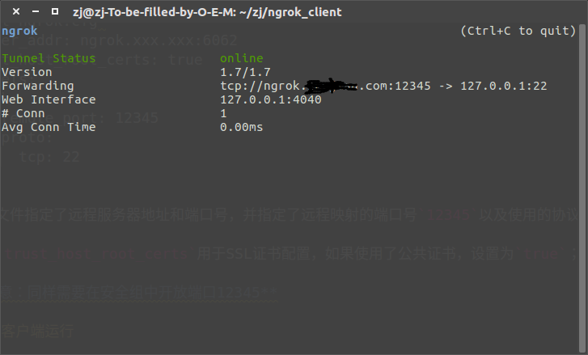

# Ngrok实现内网穿透

[ngrok](https://baike.baidu.com/item/ngrok)是一种反向代理服务，能够实现内网穿透。首先介绍其官网实现，再自建`ngrok`服务器

## 官网实现

[ngrok](https://ngrok.com/)官网已经搭建好了服务器，同时提供了客户端以及详细的教程

注册好后登录到个人主页，下载客户端进行配置

1. 下载客户端
2. 解压压缩包
3. 运行客户端程序添加账户的`authtoken`到配置文件`ngrok.yml`
4. 启动客户端

配置文件`ngrok.yml`默认放置在`~/.ngrok2`目录下

`ngrok`可使用不同协议进行通信，当前实现`ssh`连接，执行如下命令：

```
$ ./ngrok tcp 22
```



配置成功后在官网个人主页的状态栏中会列出连接的信息



这样就可以在本地打开命令行窗口连接到内网

```
$ ssh -p 12544 内网服务器用户名@0.tcp.ngrok.io
The authenticity of host '[0.tcp.ngrok.io]:12544 ([3.17.202.129]:12544)' can't be established.
ECDSA key fingerprint is SHA256:YXdgs3OJN0yxuNLLU.
Are you sure you want to continue connecting (yes/no)? yes
Warning: Permanently added '[0.tcp.ngrok.io]:12544,[3.17.202.129]:12544' (ECDSA) to the list of known hosts.
Welcome to Ubuntu 16.04.4 LTS (GNU/Linux 4.4.0-130-generic x86_64)

 * Documentation:  https://help.ubuntu.com
 * Management:     https://landscape.canonical.com
 * Support:        https://ubuntu.com/advantage

544 packages can be updated.
393 updates are security updates.

Last login: Thu Jul 11 11:00:36 2019 from 127.0.0.1
$ 
```

## 自建ngrok服务器

使用官网服务器进行内网穿透很方便，不过其延迟比较大，估计是因为服务器都搭建在国外，作者[inconshreveable](https://github.com/inconshreveable)开源了其[ngrok](https://github.com/inconshreveable/ngrok)实现，所以可以自建服务器进行配置


共分为`6`步

1. `SSL`证书配置
2. `DNS`修改
3. 客户端和服务器软件编译
4. 服务器软件运行
5. 客户端配置
6. 客户端运行

### SSL证书配置

`ngrok`通过`SSL`证书进行安全通信，有两种方式创建`SSL`证书，一是购买公共`SSL`证书，另一种是自建`SSL`证书，我在阿里云上购买了免费的[SSL证书](https://common-buy.aliyun.com/?spm=5176.2020520163.cas.3.5d5fYnY9YnY9fF&commodityCode=cas#/buy)

证书申请成功后下载解压后得到两个文件：`***.key` 和 `***.pem`

如果不是使用`https`隧道（比如`http`隧道、`ssh`隧道等），在证书上绑定指定域名即可，比如`ngrok.xxx.com`；否则添加一个通配符（`wildcard`）域名，比如`*.xxx.com`

### DNS修改

自建服务器需要申请一个域名，同时在`DNS`解析设置上新增一条`A`记录，将指定域名和服务器`IP`进行绑定

### 客户端和服务器软件编译

#### 环境配置

当前使用腾讯云服务器，首先配置运行环境（编译器+`go`环境）

```
$ sudo apt-get install mercurial git gcc g++
```

参考[Go Getting Started](https://golang.org/doc/install)进行安装

```
# 下载已编译压缩包
$ wget https://dl.google.com/go/go1.12.1.linux-amd64.tar.gz
# 解压到指定路径
$ sudo tar -C /usr/local -xzf go1.12.1.linux-amd64.tar.gz
# 设置全局变量
$ export PATH=$PATH:/usr/local/go/bin
# 测试
$ go version
go version go1.12.1 linux/amd64
```

设置环境变量`GOOS/GOARCH`为指定服务器和客户端平台，比如

```
$ export GOOS=linux
$ export GOARCH=amd64
```

#### ngrok编译

下载`ngrok`源码

```
$ git clone https://github.com/inconshreveable/ngrok.git
```

编译服务器和客户端软件

```
# 两个平台都一样的话同时编译
$ make release-all
# 或者分开编译，注意GOOS/GOARCH设置
$ make release-server
$ make release-client
```

生成的文件在`bin`目录下，`ngrok`是客户端应用，`ngrokd`是服务器应用

### 服务器软件运行

运行如下命令：

```
$ ./ngrokd -tlsKey=a.key -tlsCrt=a.pem -domain="ngrok.example.com" -httpAddr=":6060" -httpsAddr=":6061" -tunnelAddr=":6062"
```

* `tlsKey`和`tlsCrt`表示`SSL`证书地址
* `domain`表示之前配置的域名
* `ngrok`服务器会监听`HTTPS/HTTPSs/TCP`端口，默认是`80/443/4443`，修改为其他端口号

**注意：腾讯云服务器上需要在安全组设置中开放上述端口号**

### 客户端配置

下载编译好的`ngrok`到内网电脑上，创建配置文件`ngrok.cfg`:

```
$ cat ngrok.cfg 
server_addr: ngrok.xxx.xxx:6062
trust_host_root_certs: true
tunnels:
  ssh:
    remote_port: 12345
    proto:
      tcp: 22
```

配置文件指定了远程服务器地址和端口号，并指定了远程映射的端口号`12345`以及使用的协议和本地端口号`22`，表明将远程端口号`12345`和本地端口号`22`进行绑定

参数`trust_host_root_certs`用于`SSL`证书配置，如果使用了公共证书，设置为`true`；如果使用了私有证书，设置为`false`

**注意：同样需要在安全组中开放端口`12345`**

### 客户端运行

运行如下命令：

```
$ ./ngrok -config ngrok.cfg -log ngrok.log start ssh
```

参数`config`指定配置文件，参数`log`指定日志文件



运行成功后就可以打开命令行窗口登录

```
$ ssh -p 12345 zj@ngrok.xxx.xxx  # zj是内网的用户名
Welcome to Ubuntu 16.04.4 LTS (GNU/Linux 4.4.0-130-generic x86_64)

 * Documentation:  https://help.ubuntu.com
 * Management:     https://landscape.canonical.com
 * Support:        https://ubuntu.com/advantage

544 packages can be updated.
393 updates are security updates.

Last login: Thu Jul 11 12:25:19 2019 from 127.0.0.1
$ 
```

## 系统服务设置

### 外网服务器系统服务配置

在云服务器上新建`ngrokd.service`，目录是`/etc/systemd/system/`

```
$ cat ngrokd.service 
[Unit]
Description=ngrok

[Service]
ExecStart=/bin/bash /opt/ngrokd/ngrokd.sh

[Install]
WantedBy=multi-user.target
```

赋予可执行权限`777`

```
$ sudo chmod 777 ngrokd.service
```

其作用是执行`/opt/ngrokd/ngrokd.sh`脚本，脚本实现如下：

```
$ cat ngrokd.sh 
#!/bin/bash

cd /opt/ngrokd

./ngrokd -tlsKey=a.key -tlsCrt=a.pem -domain="ngrok.zhujian.com" -httpAddr=":6060" -httpsAddr=":6061" -tunnelAddr=":6062"
```

*同样授予脚本可执行权限*

### 内网服务器系统服务配置

同样在内网电脑上编写脚本`ngrok.sh`

```
#!/bin/bash

cd /opt/ngrok

./ngrok -config ngrok.cfg -log ngrok.log start ssh
```

在`/etc/systemc/system`目录下编写服务`ngrok.service`

```
[Unit]
Description=ngrok

[Service]
ExecStart=/bin/bash /opt/ngrok/ngrok.sh

[Install]
WantedBy=multi-user.target
```

**注意：基于脚本和服务程序可执行权限**

### 启动服务

使用命令`systemctl`分别启动系统服务`ngrokd.service`和`ngrok.service`

```
$ sudo systemctl start ngrok.service
```

## 相关阅读

* [How to run your own ngrokd server](https://github.com/inconshreveable/ngrok/blob/master/docs/SELFHOSTING.md)

* [Developer's guide to ngrok](https://github.com/inconshreveable/ngrok/blob/master/docs/DEVELOPMENT.md)

* [ngrok实现公网访问内网主机并开机启动，远程管理，校外也能看论文](https://zhuanlan.zhihu.com/p/54956793)

* [搭建并配置优雅的 ngrok 服务实现内网穿透](https://yii.im/posts/pretty-self-hosted-ngrokd/)
