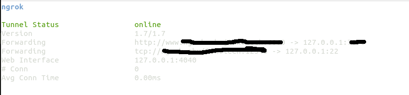

# TCP和HTTP连接配置

通过配置文件的方式设置`TCP`和`HTTP`连接

## 服务端配置

启动`ngrok`服务端应用，指定证书、域名、`http/https`端口以及隧道端口

```
./ngrokd -tlsKey=a.key -tlsCrt=a.pem -domain="xxx.xxx.xxx" -httpAddr=":port1" -httpsAddr=":port2" -tunnelAddr=":port3"
```

* 输入域名应该和证书匹配，当前使用二级域名`xxx.xxx.xxx`
* 端口号的设置方式为`:port`
    * `http`端口默认为`80`
    * `https`端口默认为`443`
    * 隧道端口默认为`4443`

## 客户端配置

通过配置文件方式来完成`HTTP`和`TCP`连接

### 配置文件

`ngrok`使用的配置文件是`YAML`格式，新建`ngrok.cfg`：

```
server_addr: DOMAIN_NAME:TUNNEL_PORT
trust_host_root_certs: true
tunnels:
  tunnel-1:
    subdomain: SUB_DOMAIN 
    remote_port: REMOTE_PORT
    proto:
      http: LOCAL_PORT
  tunnel-2:
    remote_port: REMOTE_PORT
    proto:
      tcp: LOCAL_PORT
```

* `server_addr`：指定远程服务器地址以及隧道端口
* `trust_host_root_certs`：如果使用自签名证书，设为`false`
* `tunnels`：设置要连接的服务(`TCP/HTTP/HTTPs`)

当前设置了两个服务：`tunnel-1`和`tunnel-2`。`tunnel-1`设置了`http`连接，`tunnel-2`设置了`tcp`连接

* `subdomain`：指定子域名。**注意：`http`服务均会设置子域名，如果没有设置`subdomain`属性，将会使用`tunnel-1`作为子域名**
* `remote_port`：远程绑定的端口号
* `proto`：指定当前协议和本地端口号

### 使用

启动指定服务

```
# 启动http
$ ./ngrok -config ngrok.cfg start tunnel-1
# 启动tcp
$ ./ngrok -config ngrok.cfg start tunnel-2
```

启动所有服务

```
$ ./ngrok -config ngrok.cfg start-all
```



**注意：`http`连接得到了三级域名（`xxx.xxx.xxx.xxx`），需要额外进行`DNS`解析**

## 相关阅读

* [How to run your own ngrokd server](https://github.com/inconshreveable/ngrok/blob/master/docs/SELFHOSTING.md)

* [内网穿透 ngrok 服务器和客户端配置](https://xicheng412.github.io/2016/09/27/ngrok-config/)

* [ngrok实现内网穿透，让家里的笔记本也能做服务器](https://blog.csdn.net/cece409770352/article/details/87870356)