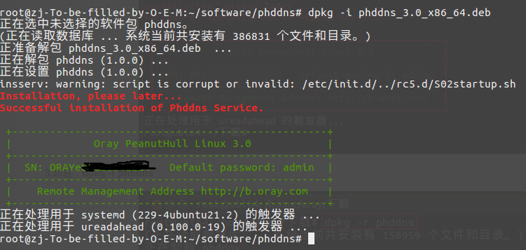

# 花生壳

[花生壳](https://b.oray.com/)是一款动态域名解析软件，通过它能够实现端口映射功能

## 安装

下载[安装包](https://hsk.oray.com/download/#linux)，以`root`用户进行安装

```
# 切换为root
$ sudo su
# 安装
$ dpkg -i phddns_3.0_x86_64.deb
```

安装完成后会生成`SN`用户名和密码



## `phddns`使用

```
# 当前版本
$ phddns version
# 当前状态
$ phddns status

# 启动
$ phddns start
# 重启
$ phddns restart
# 停止
$ phddns stop
# 重置
$ phddns reset
```

## 官网设置

登录[网站](https://b.oray.com/forward/)，使用之前的生成的`SN`用户名和密码登录，默认会赠送一个域名

如果已注册过网站，先使用`SN`用户名和密码登录，然后选择`切换帐号`服务，将`SN`绑定到之前的帐号


先购买体验版套餐，就可以设置端口映射


### 添加映射不成功

问题：填写完内网`ip`/端口后，点击确定按钮提示不成功

解决：1. 确保客户端已启动；2. 使用`SN`用户名和密码登录

## 远程登录

花生壳同时提供了远程控制工具：[向日葵](https://sunlogin.oray.com/download/)

## 相关阅读

* [如何进入学校内网？花生壳“内网穿透”服务帮上大忙](https://hsk.oray.com/news/6453.html)

* [用花生壳实现访问局域网内的SVN](http://service.oray.com/question/5575.html)

* [花生壳 3.0 for Linux 相关安装使用文档](http://service.oray.com/question/4287.html)