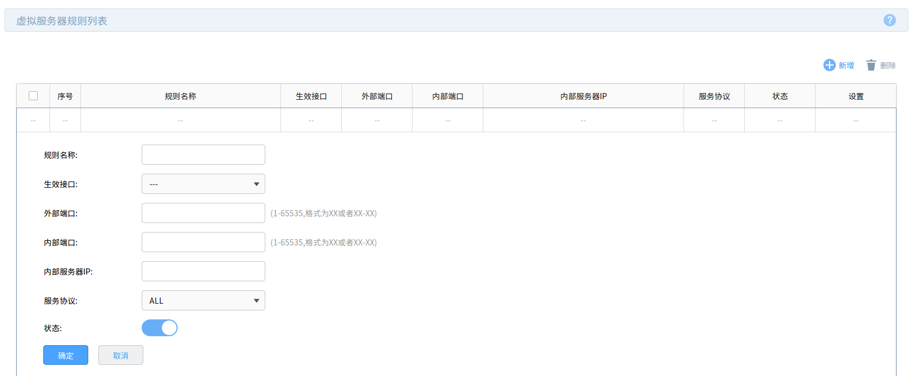

# [路由器]虚拟服务器

最简单的操作就是通过路由器的虚拟服务器功能进行端口映射

## 设置

进入设置页面，选择`高级功能`->`虚拟服务器`，点击`新增`按钮

输入规则名称（*自定义*）、生效接口（*就是WAN口，默认仅有一个WAN1口*）、外部端口、内部端口、内部服务器`IP`

## 嵌套局域网

如果当前局域网位于另一个局域网之中（比如学校实验室局域网位于学校大局域网中），那么通过路由器的虚拟服务器功能映射出去的端口仍旧处于内网中

## 相关阅读

* [路由器虚拟服务器（端口映射）设置指导](https://service.tp-link.com.cn/detail_article_69.html)