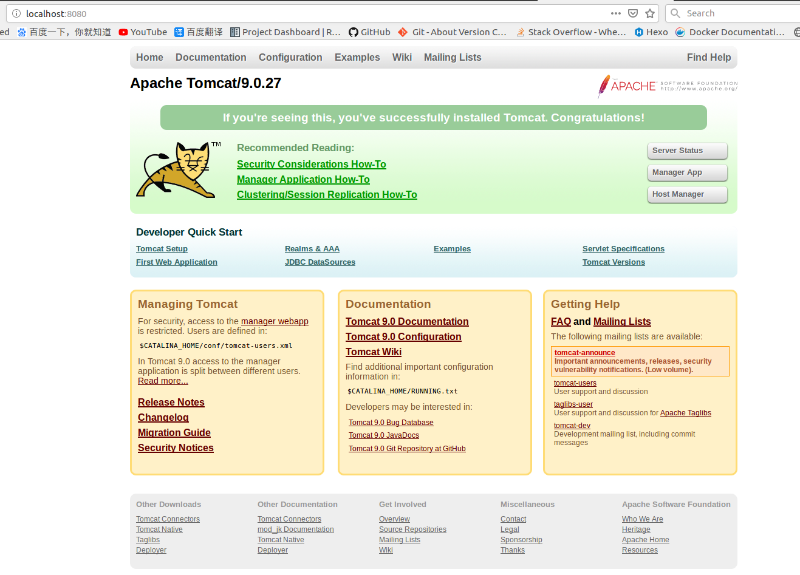

# [Ubuntu 16.02]Tomcat9安装

## 先决条件

`Tomcat`需要预先安装`JDK`

## 下载

当前最新版本：`Tomcat 9.0.27`。下载地址：[Tomcat 9 Software Downloads](https://tomcat.apache.org/download-90.cgi)

## 配置

解压到`/opt/tomcat`目录下，在`bin`目录下新建文件`setenv.sh`（*如果没有的话*）

```
# JAVA
export JAVA_HOME=/home/zj/software/java/jdk1.8.0_201
export JRE_HOME=$JAVA_HOME/jre

# Tomcat
export CATALINA_HOME=/opt/tomcat/apache-tomcat-9.0.27
export CATALINA_BASE=/opt/tomcat/apache-tomcat-9.0.27
```

## 启动

执行文件`/bin/startup.sh`，即可启动`Tomcat`

```
$ ./startup.sh 
Using CATALINA_BASE:   /opt/tomcat/apache-tomcat-9.0.27
Using CATALINA_HOME:   /opt/tomcat/apache-tomcat-9.0.27
Using CATALINA_TMPDIR: /opt/tomcat/apache-tomcat-9.0.27/temp
Using JRE_HOME:        /home/zj/software/java/jdk1.8.0_201/jre
Using CLASSPATH:       /opt/tomcat/apache-tomcat-9.0.27/bin/bootstrap.jar:/opt/tomcat/apache-tomcat-9.0.27/bin/tomcat-juli.jar
Tomcat started.
```

查询`localhost:8080`是否已被监听

```
# curl localhost:8080
<!DOCTYPE html>
<html lang="en">
    <head>
        <meta charset="UTF-8" />
        <title>Apache Tomcat/9.0.27</title>
...
...
```



## 停止

调用脚本`/bin/shutdown.sh`

## 开机自启动

修改文件`/etc/rc.local`

```
#!/bin/sh -e
#
# rc.local
#
# This script is executed at the end of each multiuser runlevel.
# Make sure that the script will "exit 0" on success or any other
# value on error.
#
# In order to enable or disable this script just change the execution
# bits.
#
# By default this script does nothing.

/opt/tomcat/apache-tomcat-9.0.27/bin/startup.sh

exit 0
```

## 相关阅读

* [Ubuntu16.04安装Tomcat](https://blog.csdn.net/ItJavawfc/article/details/87370956)

* [Ubuntu16.04服务器安装tomcat](https://blog.csdn.net/Shezzer/article/details/84074133)
